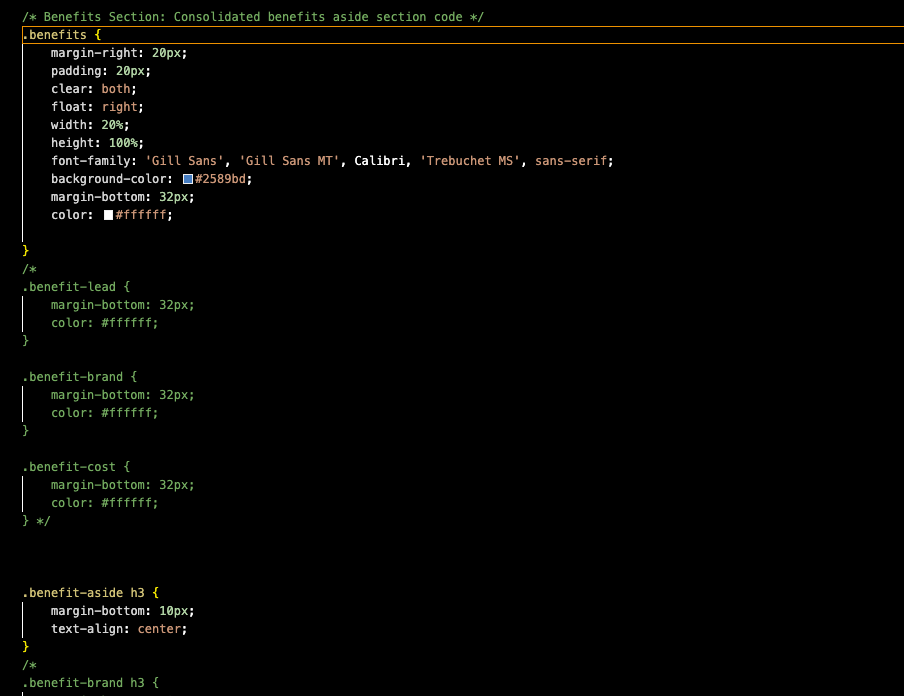

# Code-Refractor-Module 1 Challenge

# <h2>Horiseon SEO Solutions<h2>

# <h3>Description<h3>

Horiseon SEO Solutions is a static website aimed at providing information about search engine optimization (SEO), online reputation management, and social media marketing. The website highlights the importance of these digital marketing strategies in today's competitive online landscape. The project was motivated by the need to create a clear and informative platform for individuals and businesses seeking to enhance their online presence.

The goal of this project was to refractor the existing codebase of the website so that it meets accessiblity standards while also improving the logical structure. Throughout the development of this project I learned how using semantic elements can improve the flow and structure of your code making it more understandable for those who may view it. Within the CSS file I found several lines of repetitive code which I consolidated. 

# <h3>Table of Contents<h3>

    Installation
    Usage
    Credits
    License

# <h3>Installation

To run this project locally, follow these steps:

    Clone the repository to your local machine using the following command:

    bash

    git clone https://github.com/NikoMayz/Code-Refractor

    Navigate to the project directory.
    Open the index.html file in your preferred web browser.

# <h3>Usage<h3>

This website provides valuable information about various digital marketing strategies. Users can navigate through different sections to learn about search engine optimization, online reputation management, and social media marketing. The website also includes a sidebar highlighting the benefits of these strategies.

In the CSS file you will see that I commented out the repetitive lines of code instead of erasing them. This if for my own reference and also for the reviewers to review and hopefully make additional notes. If this is an unnecessary step please let me know. See the screenshot below:

# <h3>Credits<h3>
    Created by Michael Young https://github.com/NikoMayz
    https://nikomayz.github.io/Code-Refractor/

# <h3>License<h3>

This project is licensed under the MIT License - see the LICENSE file for details.
